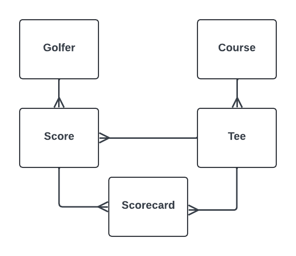

# T2G Golf Score Tracker
Basic HATEOAS-driven REST service for tracking golf scores. Built using [Spring Boot](https://github.com/spring-projects/spring-boot) and [Spring JPA](https://github.com/spring-projects/spring-data-jpa).

### Model
* `Golfer` has zero or more `Score`s
* `Course` has zero or more `Tee`s
* `Tee`s have a slope, rating and 18 `Hole`s
* `Score` has a `Tee`, a Tee Time (Date) and 18 `HoleScore`s
* `Score` uses a composite key made up of teeId, teeTime, and golferId
* `Scorecard` is a collection of all `Score`s that have matching teeId and teeTime

### `HoleScore` tracks the following stuffs for each hole:
* Strokes
* Fairway Hit
* Drive Distance
* GIR
* Putts
* Penalties
* Sand Saves
* Mulligans

### Build and Run Locally
> `mvn spring-boot run`

### Swagger API Docs
http://localhost:8080/swagger-ui/index.html

### Post a score 
> `curl -X POST --data @./sample_json/score.json -H 'Content-Type: application/json' localhost:8080/scores`

### Update a score (PUT)
> `curl -X PUT --data @./sample_json/score.json -H 'Content-Type: application/json' localhost:8080/scores`

### Get a Score
> `curl -X GET localhost:8080/scores/{teeId}/{teeTime}/{golferId}`

### Get a Scorecard
> `curl -X GET localhost:8080/scorecards/{id}`

### Get all scores for golfer
> `curl -X GET localhost:8080/scores?golfer={golferId}`

### Get a course
> `curl -X GET localhost:8080/courses/{courseId}`

### TODO + WIP
* Build course repository (@see [FreeGolf Tracker](https://freegolftracker.com/courses/findgolfcourses.php))
* UI with dashboard
* Dockerize
* Index/HDCP calculation

