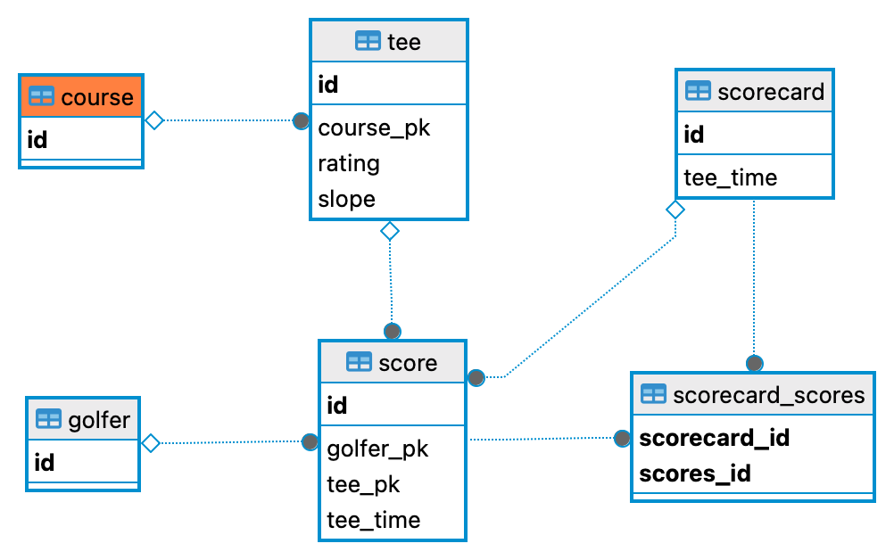

# T2G Golf Score Tracker
HATEOAS-driven REST service for tracking golf scores. Built using [Spring Boot](https://github.com/spring-projects/spring-boot) and [Spring JPA](https://github.com/spring-projects/spring-data-jpa) the model with a flat model.

## Model
* `Golfer` has zero or more `Score`s
* `Course` has one or more `Tee`s
* `Tee` has a _slope_, _rating_, and 18 `@Embedded` `Hole` members (_hole1_,...,_hole18_)
* `Score` has an _id_ primary key, 18 `@Embedded` `HoleScore` members (_holeScore1_,...,_holeScore18_), and a unique composite key composed of `Golfer`, `Tee`, and _teeTime_ (`java.time.LocalDateTime`) 
* `HoleScore` is the `@Embeddable` POJO containing fields listed below the model image
* `Scorecard` has a collection of all `Score`s (usually 1-4) for a given `Tee` and _teeTime_ (`java.time.LocalDateTime`).

### Logical 

### Physical

## `HoleScore` tracks the following stuffs for each hole:
* Strokes (`int`)
* Fairway Hit (`boolean`)
* Drive Distance (`int`)
* GIR (`boolean`)
* Putts (`int`)
* Penalties (`int`)
* Sand Save (`boolean`)
* Mulligans (`int`)

### Build and Run Locally
> `mvn spring-boot run`

### Swagger API Docs
http://localhost:8080/swagger-ui/index.html

### Post a Score 
> `curl -X POST --data @./sample_json/score.json -H 'Content-Type: application/json' localhost:8080/scores`

### Update a Score (PUT)
> `curl -X PUT --data @./sample_json/score.json -H 'Content-Type: application/json' localhost:8080/scores`

### Get a Score
Two methods
> `curl -X GET localhost:8080/scores/{teeId}/{teeTime}/{golferId}`

> `curl -X GET localhost:8080/scores?id={id}`

### Get a Scorecard
> `curl -X GET localhost:8080/scorecards/{id}`

### Get all Scores for a Golfer
> `curl -X GET localhost:8080/scores?golfer={golferId}`

### Get a Course
> `curl -X GET localhost:8080/courses/{courseId}`

### TODO + WIP
* Build course repository (@see [FreeGolf Tracker](https://freegolftracker.com/courses/findgolfcourses.php))
* `Golfer`: add _homeCourse_ member
* Dashboard (Nuxt?)
* UI using Munin/Langchain
* Dockerize
* USGA Index/HDCP calculation
* Security stuffs

